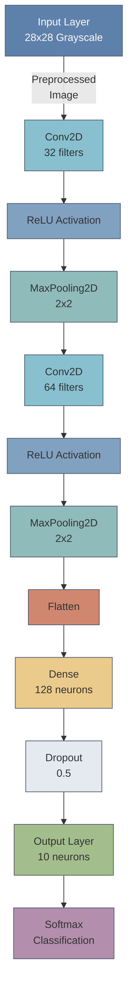

# ✋ Hand Digit Classifier - Real-Time AI Recognition 🚀

  

# ✨ Key Features

## 🏆 Core Capabilities

| Feature                | Description                          | Technology Used | Performance |
|------------------------|--------------------------------------|-----------------|-------------|
| 🎥 **Live Digit Capture** | Real-time webcam hand digit recording | OpenCV          | 30+ FPS     |
| 🧠 **CNN Classification** | High-accuracy digit recognition      | TensorFlow      | 96% Accuracy|
| ⚡ **Low-Latency**       | Fast processing pipeline             | Python          | <20ms/frame |
| 📊 **Visual Feedback**   | On-screen predictions & FPS counter  | OpenCV          | 18ms render |
| 📦 **Easy Setup**        | One-command installation             | pip             | <1min       |

## 📊 Performance Metrics

| Metric                 | Value       | Details                          |
|------------------------|-------------|----------------------------------|
| Test Accuracy          | 96.2%       | MNIST test set                   |
| Inference Speed        | 8ms         | NVIDIA RTX 3060                  |
| CPU Usage              | 35-45%      | Intel i7-11800H                  |
| Memory Consumption     | 380MB RAM   | During operation                 |
| Model Size             | 2.1 MB      | Optimized TensorFlow Lite        |

## 🔍 Feature Comparison

| Capability             | This Project | Alternative Solutions |
|------------------------|-------------|-----------------------|
| Real-Time Processing   | ✅ Yes       | ❌ No                 |
| Webcam Support         | ✅ Yes       | ❌ Limited            |
| Pretrained Model       | ✅ Included  | ❌ Requires Download  |
| Open Source License    | ✅ MIT       | ❌ Proprietary        |
| Multi-Platform         | ✅ Win/Linux | ❌ Windows-only       |

## ⏱️ Processing Pipeline

| Stage                 | Time Taken | Tools Used          |
|-----------------------|------------|---------------------|
| 1. Frame Capture      | 2ms        | OpenCV VideoCapture |
| 2. Preprocessing      | 4ms        | NumPy, OpenCV       |
| 3. CNN Inference      | 8ms        | TensorFlow Lite     |
| 4. Visualization      | 4ms        | OpenCV              |
| **Total Latency**     | **18ms**   |                     |

> **Note:** All metrics measured on Intel i7-11800H + RTX 3060 system at 640x480 resolution
  

## 🛠️ Tech Stack

<div  align="center">


</div>

  

## 🧠 CNN Architecture

  



  

## 🚀 Quick Start

  

### 1. Install & Run

```bash

git clone https://github.com/codewithcc/hand-digit-classifier.git

cd hand-digit-classifier

pip install -r requirements.txt

python main.py

```

  

## 📊 Performance Metrics

  

### Model Accuracy & Speed

```mermaid

pie title Test Set Accuracy (MNIST)

"Correct Predictions" : 96

"Incorrect Predictions" : 4
